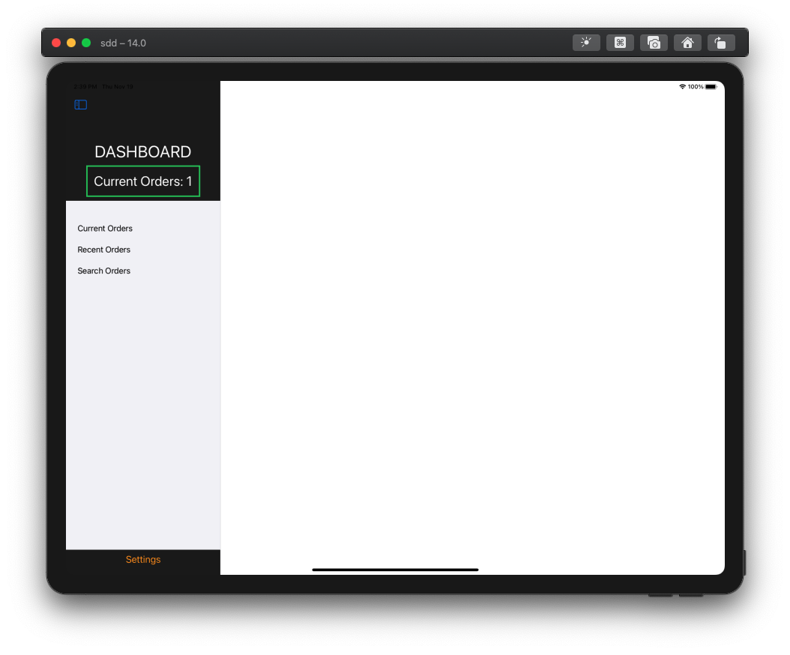

# GuruLukshmi_DashBoard
- Dash Board for admin and staff member

### Technologies / Libraries used to create this project 
- Xcode
- Swift/SwiftUI
- Firebase / Firebase Auth
- [SwiftUICharts](https://github.com/AppPear/ChartView)

## Here are some screenshots of app 

### - Login View for both staff members and admin

### - Staff View

### New orders will be shown here

### They have option to search by ID and by any date

### - Admin View
### Business Graphs 

### CRUD operation on food can be done here

